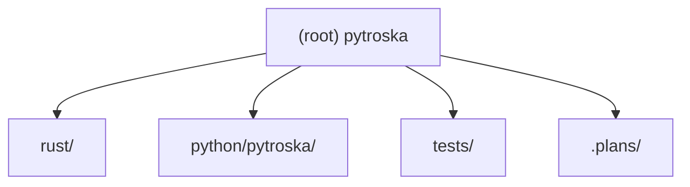

# Pytroska — Root CLAUDE.md

## Project Vision

Pytroska aims to be the high-performance, native MKV (Matroska) file processing library for the Python ecosystem. The current Python landscape lacks a solution that is both fast and fully featured: `pymkv` is a wrapper around `mkvmerge`, `mkvparse` is unmaintained, and `python-matroska` has negligible community activity. Pytroska fills this gap using a Rust + Python hybrid architecture to deliver:

- Direct binary EBML/Matroska parsing (no external tool dependencies)
- 10–50x performance improvement over pure-Python implementations
- Full Matroska specification coverage (video, audio, subtitles, chapters, tags, attachments, seeking)
- Pythonic, type-annotated API targeting Python >= 3.11
- Read-first priority; write support planned for a later phase

---

## Architecture Overview

```
Python Layer  (python/pytroska/)
  MKVFile | Track | Chapter | Tag | Attachment | Cue
      |
  Exception hierarchy (exceptions.py — re-exports from Rust)
      |
  Python-Rust FFI (PyO3 / maturin)
      |
Rust Layer  (rust/)
  lib.rs        — PyO3 module entry; registers all pyclasses and pyfunctions
  errors.rs     — PytroskaRustError enum; Python exception class creation via create_exception!
  header.rs     — EbmlHeader pyclass; parse_ebml_header(path) pyfunction
  reader.rs     — MkvReader struct; orchestrates header + info extraction
  info.rs       — SegmentInfo pyclass; parse_info_children(); extract_info()
  [planned]     — tracks, cluster, demux, cues, chapters, tags, attachments, utils/
      |
  I/O           — BufReader<File> via webm-iterable WebmIterator<_, MatroskaSpec>
```

Key design decisions:

| Decision | Choice |
|----------|--------|
| EBML parsing | `webm-iterable` crate (includes full `MatroskaSpec`) |
| Rust-Python binding | `PyO3 0.28.2` + `maturin >= 1.7` |
| Feature priority | Read-first; write in later phases |
| Python version | >= 3.11 |
| Dependency manager | `uv` |
| Python linting | `ruff` + `isort` |
| Python type checking | `pyright` (strict mode) |
| Python testing | `pytest` |
| Python style | Numpy docstrings; single-quoted strings; line length 88 |
| Rust formatting | `rustfmt` |
| Rust static analysis | `clippy` |
| Rust edition | 2024 (stable) |

---

## Module Structure



---

## Module Index

| Path | Language | Role | Status |
|------|----------|------|--------|
| `rust/lib.rs` | Rust | PyO3 module entry point; registers all submodules and functions | Phase 4 complete |
| `rust/errors.rs` | Rust | `PytroskaRustError` enum; Python exception hierarchy via `create_exception!` | Phase 2 complete |
| `rust/header.rs` | Rust | `EbmlHeader` pyclass; `parse_ebml_header(path)` pyfunction | Phase 3 complete |
| `rust/reader.rs` | Rust | `MkvReader` struct; orchestrates header + info parsing via single-pass WebmIterator | Phase 4 complete |
| `rust/info.rs` | Rust | `SegmentInfo` pyclass; `extract_info()`; `parse_info_children()` | Phase 4 complete |
| `rust/tracks.rs` | Rust | `TrackInfo`, `VideoSettings`, `AudioSettings` extraction | Phase 5 (planned) |
| `rust/cluster.rs` | Rust | Cluster/Block parsing | Phase 8 (planned) |
| `rust/demux.rs` | Rust | Demux iterator over decoded frames | Phase 8 (planned) |
| `rust/cues.rs` | Rust | Cues index + seek support | Phase 9 (planned) |
| `rust/chapters.rs` | Rust | Chapter parsing | Phase 10 (planned) |
| `rust/tags.rs` | Rust | Tag parsing | Phase 10 (planned) |
| `rust/attachments.rs` | Rust | Attachment parsing | Phase 10 (planned) |
| `rust/utils/lacing.rs` | Rust | Xiph/EBML/Fixed-size lacing decode | Phase 7 (planned) |
| `rust/utils/timecode.rs` | Rust | Nanosecond timecode conversion utilities | Phase 7 (planned) |
| `python/pytroska/__init__.py` | Python | Public API surface; re-exports exceptions, `SegmentInfo`, `core_version`, `parse_segment_info` | Phase 4 complete |
| `python/pytroska/_pytroska_core.pyi` | Python | Type stubs for Rust extension: `EbmlHeader`, `SegmentInfo`, exception classes, functions | Phase 4 complete |
| `python/pytroska/exceptions.py` | Python | Re-exports Rust-defined exception hierarchy | Phase 2 complete |
| `python/pytroska/py.typed` | Python | PEP 561 marker | Phase 1 complete |
| `python/pytroska/types.py` | Python | `TrackType` enum and shared type definitions | Phase 5 (planned) |
| `python/pytroska/tracks.py` | Python | `Track`, `VideoTrack`, `AudioTrack` Python wrappers | Phase 6 (planned) |
| `python/pytroska/file.py` | Python | `MKVFile` high-level class with context manager support | Phase 6 (planned) |
| `python/pytroska/chapters.py` | Python | `Chapter` Python wrapper | Phase 10 (planned) |
| `python/pytroska/tags.py` | Python | `Tag` Python wrapper | Phase 10 (planned) |
| `python/pytroska/attachments.py` | Python | `Attachment` Python wrapper | Phase 10 (planned) |
| `python/pytroska/cues.py` | Python | `Cue` Python wrapper | Phase 9 (planned) |
| `python/pytroska/utils.py` | Python | High-level utility functions (`verify_mkv_file`, `get_media_info`) | Phase 6+ (planned) |
| `tests/conftest.py` | Python | Session-scoped fixtures; auto-downloads 8 official Matroska test files with SHA-256 verification | Phase 3 complete |
| `tests/test_smoke.py` | Python | Import, `core_version()`, `__version__` | Phase 1 complete |
| `tests/test_errors.py` | Python | Exception hierarchy, `isinstance` checks, pickle round-trip | Phase 2 complete |
| `tests/test_header.py` | Python | EBML header fields, error paths, unsupported DocType | Phase 3 complete |
| `tests/test_info.py` | Python | Segment duration, timecode scale, muxing/writing app, SegmentUID | Phase 4 complete |

---

## Running and Development

### Prerequisites

- Rust toolchain (stable), `cargo` in `$PATH`
- Python >= 3.11
- `uv` package manager

### First-time setup

```bash
uv sync --all-groups --no-install-project
uv run maturin develop --uv
```

### Development cycle

```bash
# After changing any Rust source:
uv run maturin develop --uv

# Rust quality checks:
cargo fmt --check
cargo clippy -- -D warnings
cargo test

# Python quality checks:
uv run ruff check python/ tests/
uv run ruff format --check python/ tests/
uv run isort --check python/ tests/
uv run pyright python/

# Run all tests:
uv run pytest tests/ -v
```

### Building a wheel

```bash
uv run maturin build --release
```

---

## Test Strategy

Tests live in `tests/`. `tests/conftest.py` auto-downloads the 8 official Matroska test files from `https://github.com/ietf-wg-cellar/matroska-test-files` into `tests/fixtures/` on first run, with SHA-256 hash verification and re-download on corruption. Uses only `urllib.request` — no extra dependency.

| Test file | Phase | Coverage target |
|-----------|-------|----------------|
| `test_smoke.py` | 1 | Import, `core_version()`, `__version__` |
| `test_errors.py` | 2 | Exception hierarchy, inheritance, pickle round-trip |
| `test_header.py` | 3 | EBML header fields, error paths, unsupported DocType |
| `test_info.py` | 4 | Segment duration, timecode scale, muxing app, SegmentUID |
| `test_tracks.py` | 5 | Track counts, codecs, video resolution, audio channels (planned) |
| `test_file.py` | 6 | `MKVFile` API, context manager, filtering by type (planned) |
| `test_demux.py` | 8 | Frame iteration and decoded packet structure (planned) |
| `test_cues.py` | 9 | Cue index lookup (planned) |
| `test_seek.py` | 9 | Seek-by-timestamp accuracy (planned) |
| `test_chapters.py` | 10 | Chapter metadata (planned) |
| `test_tags.py` | 10 | Tag metadata (planned) |
| `test_attachments.py` | 10 | Attachment extraction (planned) |
| `test_integration.py` | 11 | Full-pipeline integration over all 8 test files (planned) |

---

## Coding Conventions

### Rust

- Edition 2024; `rustfmt` defaults; `clippy` with `-D warnings`
- All public PyO3 items use `#[pyclass(frozen, get_all, skip_from_py_object)]` where applicable
- Python exception classes defined via `create_exception!(pytroska._pytroska_core, Name, Parent)`
- Internal Rust errors use `PytroskaRustError` enum (thiserror); `From<PytroskaRustError> for PyErr` maps variants to Python exception classes
- `TagIteratorError` mapped via `map_tag_iterator_error()` helper in `errors.rs`
- Module files registered explicitly in `rust/lib.rs`
- `tracing` crate used for structured logging (e.g., warn on invalid SegmentUID length)

### Python

- Type annotations required everywhere; `pyright` in strict mode
- Single-quoted strings; line length 88 (`ruff` enforced)
- Docstrings follow Numpy convention
- Exception classes re-exported from `pytroska.exceptions`
- `py.typed` marker present for PEP 561 compliance
- `isort` known_first_party = `["pytroska"]` (note: `pyproject.toml` has a trailing space bug — should be `["pytroska"]` not `["pytroska "]`)

---

## Known Issues and TODOs

- **Phase 5 ordering bug (documented)**: `reader.rs` contains a detailed `TODO(Phase 5)` comment. RFC 9559 does not guarantee `Info` precedes `Tracks`; the current sequential `extract_info` then `extract_tracks` approach will silently drop `Tracks` if it appears first. The fix is a single-pass loop in `MkvReader::open()` collecting both elements before `Cluster`.
- **isort config typo**: `known_first_party = ["pytroska "]` has a trailing space in `pyproject.toml` — should be `["pytroska"]`.
- `EbmlHeader` is not yet exposed in `python/pytroska/__init__.py` public API (only accessible via `_pytroska_core` directly).

---

## AI Usage Guidelines

- All source files should be read before editing; never speculate about content
- Rust changes always require `uv run maturin develop --uv` before Python tests
- When adding a new Rust pyclass or pyfunction, update `python/pytroska/_pytroska_core.pyi` in the same commit
- Prefer `TagIterator::<_, MatroskaSpec>` over raw byte parsing
- Implementation phases are documented in `.plans/pytroska-implement-phases.md` — follow phase order to avoid broken dependencies
- Architecture rationale is in `.plans/pytroska-architecture-report.md`
- Phase 5 must refactor `MkvReader::open()` to a single-pass loop (see `rust/reader.rs` TODO comment)

---

## Changelog

| Date | Description |
|------|-------------|
| 2026-03-08 | Updated by architecture scan. Phases 2–4 now complete: `errors.rs`, `header.rs`, `reader.rs`, `info.rs` implemented; `exceptions.py`, `_pytroska_core.pyi` updated for Phase 4; `conftest.py`, `test_errors.py`, `test_header.py`, `test_info.py` added. `tracing` crate added as dependency. Phase 5 ordering issue documented in `reader.rs`. |
| 2026-03-02 | Initial CLAUDE.md generated by architecture scan. Phase 1 scaffold complete: `Cargo.toml`, `pyproject.toml`, `rust/lib.rs`, `python/pytroska/__init__.py`, `_pytroska_core.pyi`, `py.typed`, `tests/test_smoke.py`. |
