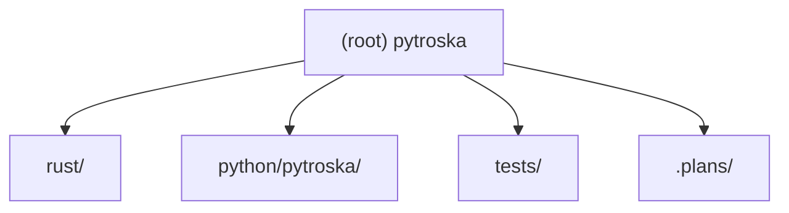

# Pytroska — Root CLAUDE.md

## Project Vision

Pytroska aims to be the high-performance, native MKV (Matroska) file processing library for the Python ecosystem. The current Python landscape lacks a solution that is both fast and fully featured: `pymkv` is a wrapper around `mkvmerge`, `mkvparse` is unmaintained, and `python-matroska` has negligible community activity. Pytroska fills this gap using a Rust + Python hybrid architecture to deliver:

- Direct binary EBML/Matroska parsing (no external tool dependencies)
- 10–50x performance improvement over pure-Python implementations
- Full Matroska specification coverage (video, audio, subtitles, chapters, tags, attachments, seeking)
- Pythonic, type-annotated API targeting Python >= 3.11
- Read-first priority; write support planned for a later phase

---

## Architecture Overview

```
Python Layer  (python/pytroska/)
  MKVFile | Track | Chapter | Tag | Attachment | Cue
      |
  Matroska Semantic Layer
      |
  Python-Rust FFI (PyO3 / maturin)
      |
Rust Layer  (rust/)
  EBML Parser   — via webm-iterable crate (TagIterator<_, MatroskaSpec>)
  Segment       — info, tracks, cluster, cues, chapters, tags, attachments
  I/O           — BufReader<File>, seeking, lacing, timecodes
```

Key design decisions:

| Decision | Choice |
|----------|--------|
| EBML parsing | `webm-iterable` crate (includes full `MatroskaSpec`) |
| Rust-Python binding | `PyO3` + `maturin` |
| Feature priority | Read-first; write in later phases |
| Python version | >= 3.11 |
| Dependency manager | `uv` |
| Python linting | `ruff` + `isort` |
| Python type checking | `pyright` (strict mode) |
| Python testing | `pytest` |
| Python style | Google Python Style Guide, Numpy docstrings |
| Rust formatting | `rustfmt` |
| Rust static analysis | `clippy` |
| Rust edition | 2024 (stable) |

---

## Module Structure



---

## Module Index

| Path | Language | Role | Status |
|------|----------|------|--------|
| `rust/lib.rs` | Rust | PyO3 module entry point; registers all submodules and functions | Phase 1 complete |
| `rust/errors.rs` | Rust | Error enum `PytroskaError`; Python exception hierarchy | Phase 2 (planned) |
| `rust/header.rs` | Rust | EBML header parsing; exposes `EbmlHeader` pyclass | Phase 3 (planned) |
| `rust/reader.rs` | Rust | `MkvReader` core struct; orchestrates metadata parsing | Phase 4 (planned) |
| `rust/info.rs` | Rust | `SegmentInfo` extraction (duration, title, muxing app) | Phase 4 (planned) |
| `rust/tracks.rs` | Rust | `TrackInfo`, `VideoSettings`, `AudioSettings` extraction | Phase 5 (planned) |
| `rust/cluster.rs` | Rust | Cluster/Block parsing | Phase 8 (planned) |
| `rust/demux.rs` | Rust | Demux iterator over decoded frames | Phase 8 (planned) |
| `rust/cues.rs` | Rust | Cues index + seek support | Phase 9 (planned) |
| `rust/chapters.rs` | Rust | Chapter parsing | Phase 10 (planned) |
| `rust/tags.rs` | Rust | Tag parsing | Phase 10 (planned) |
| `rust/attachments.rs` | Rust | Attachment parsing | Phase 10 (planned) |
| `rust/utils/lacing.rs` | Rust | Xiph/EBML/Fixed-size lacing decode | Phase 7 (planned) |
| `rust/utils/timecode.rs` | Rust | Nanosecond timecode conversion utilities | Phase 7 (planned) |
| `python/pytroska/__init__.py` | Python | Public API surface; re-exports from Rust core and submodules | Phase 1 complete |
| `python/pytroska/_pytroska_core.pyi` | Python | Type stubs for the Rust extension module | Phase 1 complete |
| `python/pytroska/exceptions.py` | Python | Re-exports Rust-defined exception hierarchy | Phase 2 (planned) |
| `python/pytroska/types.py` | Python | `TrackType` enum and shared type definitions | Phase 4 (planned) |
| `python/pytroska/tracks.py` | Python | `Track`, `VideoTrack`, `AudioTrack` Python wrappers | Phase 6 (planned) |
| `python/pytroska/file.py` | Python | `MKVFile` high-level class with context manager support | Phase 6 (planned) |
| `python/pytroska/chapters.py` | Python | `Chapter` Python wrapper | Phase 10 (planned) |
| `python/pytroska/tags.py` | Python | `Tag` Python wrapper | Phase 10 (planned) |
| `python/pytroska/attachments.py` | Python | `Attachment` Python wrapper | Phase 10 (planned) |
| `python/pytroska/cues.py` | Python | `Cue` Python wrapper | Phase 9 (planned) |
| `python/pytroska/utils.py` | Python | High-level utility functions (`verify_mkv_file`, `get_media_info`) | Phase 6+ (planned) |
| `tests/` | Python | pytest test suite; fixtures download official Matroska test files | Phase 1 partial |

---

## Running and Development

### Prerequisites

- Rust toolchain (stable), `cargo` in `$PATH`
- Python >= 3.11
- `uv` package manager

### First-time setup

```bash
uv sync --all-groups --no-install-project
uv run maturin develop --uv
```

### Development cycle

```bash
# After changing any Rust source:
uv run maturin develop --uv

# Rust quality checks:
cargo fmt --check
cargo clippy -- -D warnings
cargo test

# Python quality checks:
uv run ruff check python/ tests/
uv run ruff format --check python/ tests/
uv run isort --check python/ tests/
uv run pyright python/

# Run all tests:
uv run pytest tests/ -v
```

### Building a wheel

```bash
uv run maturin build --release
```

---

## Test Strategy

Tests live in `tests/`. The planned `tests/conftest.py` will auto-download the 8 official Matroska test files from `https://github.com/ietf-wg-cellar/matroska-test-files` into `tests/fixtures/` on first run (using only `urllib.request` — no extra dependency).

| Test file | Coverage target |
|-----------|----------------|
| `test_smoke.py` | Import, `core_version()`, package `__version__` |
| `test_errors.py` | Exception hierarchy and inheritance (Phase 2) |
| `test_header.py` | EBML header fields, error paths (Phase 3) |
| `test_info.py` | Segment duration, timecode scale, muxing app (Phase 4) |
| `test_tracks.py` | Track counts, codecs, video resolution, audio channels (Phase 5) |
| `test_file.py` | `MKVFile` API, context manager, filtering by type (Phase 6) |
| `test_demux.py` | Frame iteration and decoded packet structure (Phase 8) |
| `test_cues.py` | Cue index lookup (Phase 9) |
| `test_seek.py` | Seek-by-timestamp accuracy (Phase 9) |
| `test_chapters.py` | Chapter metadata (Phase 10) |
| `test_tags.py` | Tag metadata (Phase 10) |
| `test_attachments.py` | Attachment extraction (Phase 10) |
| `test_integration.py` | Full-pipeline integration over all 8 test files (Phase 11) |

---

## Coding Conventions

### Rust

- Edition 2024; `rustfmt` defaults; `clippy` with `-D warnings`
- All public PyO3 items use `#[pyclass(frozen, get_all)]` where applicable
- Errors defined in `rust/errors.rs` using `thiserror`; implement `From<PytroskaError> for PyErr`
- Module files registered explicitly in `rust/lib.rs`

### Python

- Type annotations required everywhere; `pyright` in strict mode
- Single-quoted strings; line length 88 (`ruff` enforced)
- Docstrings follow Numpy convention
- Exception classes re-exported from `pytroska.exceptions`
- `py.typed` marker present for PEP 561 compliance

---

## AI Usage Guidelines

- All source files should be read before editing; never speculate about content
- Rust changes always require `uv run maturin develop --uv` before Python tests
- When adding a new Rust pyclass or pyfunction, update `python/pytroska/_pytroska_core.pyi` in the same commit
- Prefer `TagIterator::<_, MatroskaSpec>` over raw byte parsing
- Implementation phases are documented in `.plans/pytroska-implement-phases.md` — follow phase order to avoid broken dependencies
- Architecture rationale is in `.plans/pytroska-architecture-report.md`

---

## Changelog

| Date | Description |
|------|-------------|
| 2026-03-02 | Initial CLAUDE.md generated by architecture scan. Phase 1 scaffold complete: `Cargo.toml`, `pyproject.toml`, `rust/lib.rs`, `python/pytroska/__init__.py`, `_pytroska_core.pyi`, `py.typed`, `tests/test_smoke.py`. |
